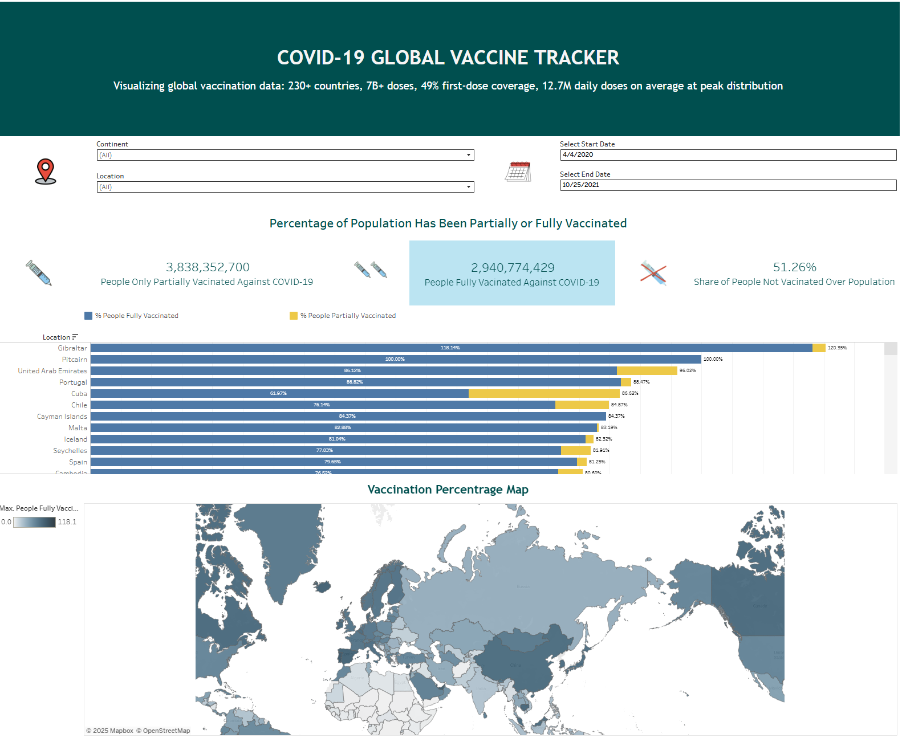

# COVID-19 GLOBAL VACCINE TRACKER

A data visualization project built in Tableau to track the progress and distribution of COVID-19 vaccines globally. This dashboard provides key insights into vaccination rates, regional performance, and total doses administered to support public understanding and data-driven decision-making.

  
*COVID-19 Global Vaccine Tracker*

---

## 📊 Dashboard Link:
🔗 [View Live Dashboard](https://public.tableau.com/app/profile/nguyen.nguyen4911/viz/COVID-19VaccineGlobalTracker_17486391982590/COVID-19GlobalVaccineTracker)

## 📌 Project Summary:
This project aims to analyze global COVID-19 vaccination efforts using interactive visualizations. With the help of Tableau, I created a dynamic and informative dashboard that highlights:

- Total vaccinations administered worldwide.
- Top vaccinated countries by dose count.
- Vaccination rates by continent.
- Daily vaccination trends.
- Interactive filters for country-level and regional insights.

## 🧰 Tools & Technologies Used:

- Data Visualization: Tableau.
- Data Processing: Excel.

## 🔍 Key Insights:

- Over 13 billion vaccine doses have been administered globally.
- Countries like China, India, and the United States lead in total vaccination counts.
- Some smaller countries demonstrate higher per capita vaccination rates.
- Regional disparities reveal vaccination access gaps across continents.

## 🧪 Methodology:
- Data Acquisition: Collected updated COVID-19 vaccination data
- Data Cleaning (Excel):
   - Filtered for relevant columns (date, location, total_vaccinations, people_fully_vaccinated, etc.)
   - Removed null or inconsistent records
   - Aggregated data at the country and regional levels

- Data Visualization (Tableau):
   - Built dynamic charts and interactive filters
   - Designed clear layout with KPIs, charts, and map visuals
   - Published to Tableau Public for accessibility
